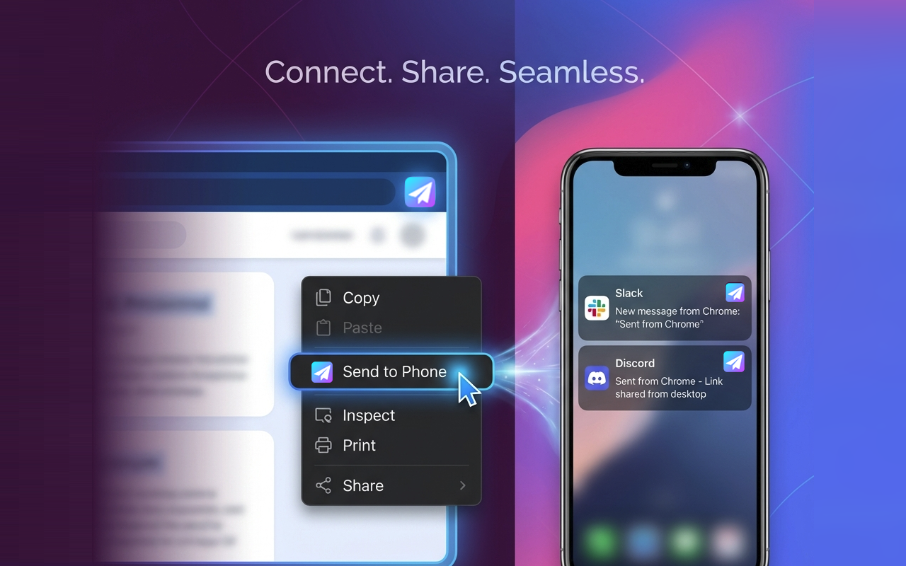

# Right Click Send to Phone

**Right Click Send to Phone** is a Chrome extension that allows you to seamlessly send text, links, and images from your browser directly to your phone via Slack or Discord.

## Features

-   **Context Menu Integration**: Simply right-click on any selected text, link, or image to send it.
-   **Slack Integration**: Connect your Slack workspace and send messages to your own private channel.
-   **Discord Integration**: Use a Discord Webhook to send content to a specific channel.
-   **Quick & Easy**: No need to open new tabs or copy-paste manually.

## Installation

1.  Clone this repository.
2.  Open Chrome and navigate to `chrome://extensions/`.
3.  Enable "Developer mode" in the top right corner.
4.  Click "Load unpacked" and select the `rightClickSendToPhone` directory from this repository.

## Usage

1.  Click the extension icon in your toolbar to configure your settings.
2.  Choose between Slack or Discord.
3.  Follow the instructions to set up your Webhook URL (for Discord) or authenticate (for Slack).
4.  Right-click on any content in a webpage and select "Send to Phone".

## Privacy Policy

We value your privacy. This extension does not store any of your data on our servers. All data transfer happens directly between your browser and the service you choose (Slack or Discord).

[Read our full Privacy Policy](https://jatacid.github.io/right-click-send-to-phone/privacy.html)

## License

This project is licensed under the MIT License - see the [LICENSE](LICENSE) file for details.

## Credits

Made with &hearts; by [Jatacid](https://jatacid.github.io/right-click-send-to-phone/)
